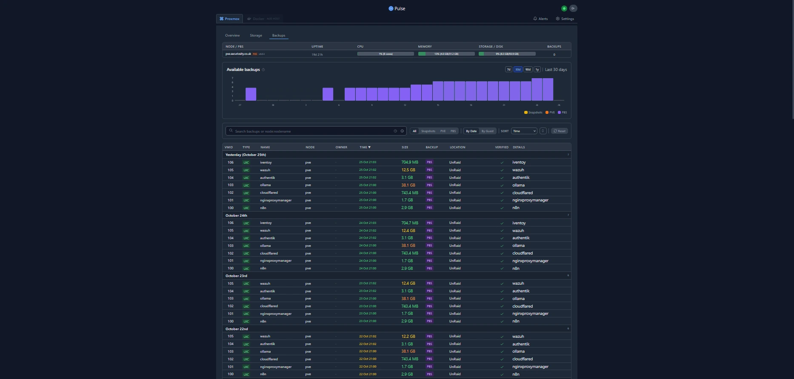

I think all of us are looking for very cool tools that can add modern dashboards to Proxmox and to help monitor what is going on with your Proxmox host, cluster hosts, VMs, and LXC containers. There is a new open source project that can do just that. It is called Pulse. Pulse is a new and exciting community tool that is available for monitoring Proxmox. Let’s take a look at the features and capabilities that Pulse brings to the table.

## What is Pulse?

Pulse is an open‑source, lightweight monitoring platform purpose‑built for Proxmox VE. It connects to Proxmox using the official API to collect telemetry from hosts, cluster nodes, VMs and LXC containers, and presents that data in a single, web‑based dashboard. Key capabilities include real‑time resource metrics (CPU, memory, disk, network), hardware sensor telemetry (temperatures, fans, power), service and VM/container health indicators, and integrations for alerts and automation via API tokens and webhooks. Pulse is self‑contained — bundling storage and processing into a single deployment — making it well suited for homelabs and resource‑constrained clusters while providing production‑grade visibility and automation options.

## What does Pulse do?

Pulse collects telemetry from Proxmox VE via the Proxmox API and presents it in a single, web-based dashboard. Once connected to your cluster it automatically discovers configured nodes and begins ingesting and visualizing live metrics.

Key capabilities:
- Real‑time resource metrics (CPU, memory, disk, network) for nodes, VMs and LXC containers.
- Health and status indicators for VMs/containers and host services.
- Hardware sensor data (temperatures, fans, power) when exposed by the host.
- Lightweight architecture: single deployment with embedded storage — no external database or additional services required.
- Integrations for automated notifications and automation via pre-generated API tokens, agents and webhooks.

Because it bundles storage and processing into one deployable unit, Pulse is suitable for small VMs, LXCs or Docker containers and is a good fit for constrained homelab or clustered environments that need a compact monitoring solution.

## Features

  -  Auto-discovery – Finds Proxmox nodes automatically with one-line installation scripts
  -  Cluster monitoring – You can monitor Proxmox clusters
  -  Enterprise security – It has good security, including encrypted credentials, CSRF protection, rate limiting, secure sessions, and bcrypt password hashing
  -  Detailed audit logging – It tracks logins, configuration changes, and alert history
  -  Live monitoring – You can view real-time performance for VMs, containers, storage, and nodes
  -  Alerts to modern services – Get notifications using email or webhooks (Discord, Slack, Telegram, Teams, ntfy.sh, Gotify)
  -  Adaptive thresholds – You can set dynamic alert levels with customizable triggers and resets
  -  Alert timeline and analytics – It has an alert history, shows trends, and acknowledgment states
  -  Ceph integration – Ceph health, including pool utilization, and daemon status automatically
  -  Backup visibility – Get visibility of PBS backups, snapshots, and Proxmox backups with analytics
  -  Mail gateway insights – You can monitor mail volume, spam trends, and quarantine health for PMG
  -  Optional Docker monitoring – Lightweight agent support for container metrics
  -  Configuration management – Export and import encrypted configs with authentication
  -  Automatic updates – Safe, stable updates with rollback option
  -  Modern UI – Dark and light themes, responsive, built with Go for minimal resource usage


## Installing Pulse Monitoring in a Docker container

Installation is fairly simple with docker compose, with a fairly minimal configuration required inside the compose file we will do most of the configuration in the web browser later on. As always ill put my docker compose files under the directory ```docker_volumes/{service}```

To Get started we're going to first setup our docker compose file which I've provided below

Couple of notes I've prefilled out the authentication username and password and pre generated an API token for webhooks. Please change these values in a production environment.

```shell
   # docker-compose.yml
services:
  pulse:
    image: rcourtman/pulse:latest
    container_name: pulse
    restart: unless-stopped
    ports:
      - "7655:7655"
    environment:
      # First-boot admin (plain text; Pulse will bcrypt-hash it internally)
      PULSE_AUTH_USER: admin
      PULSE_AUTH_PASS: Letmein1$ #ChangeMe

      # Pre-generated API token for agents/webhooks
      API_TOKEN: 1bd764fae4c664d7f6158a814f8bf718f9e32e0c88b85fadb3ae2980eeea05f8 #ChangeMe

      # Optional: limit network discovery scope (example)
      # DISCOVERY_SUBNET: "192.168.50.0/24"
    volumes:
      - /data:/data 
```
Save the file and run the below command

```shell
docker compose up -d
```

After the container spins up, you should be able to browse to port 7655 on your Docker host where you spun up the container. We can login and we should be greeted with the below!


We can now work on adding our first PVE host to Pulse, Thankfully they make this the most painless process you could possibly imagine lets go into settings and select add a new PVE Node


Filling out the hostname URL ```https://{your_pve_ip}:8006``` we can then copy the command and paste it into the proxmox shell. 


Now, I have copied the command and logged into the PVE host node, opened the shell prompt and pasted in the command. Run the command. You will see the script stop and prompt you if you want to Enable hardware temperature monitoring for this node? Enter Yes.

Let this complete we should then see our PVE Node inside pulse. We can then move to check out the power of Pulse at a glance.


Almost immdietely we can see we have a really solid overview of all of our containers, now we would get alerts if we had any problems which is fantastic however I didnt get any (Must be a pro)

On the Overview page, nodes and VMs are displayed with real‑time metrics, providing a clear and immediate summary of cluster health. However, these tiles are not interactive — you cannot click through to view more detailed information for a specific VM or node. Adding drill‑through capability to open per‑resource pages (detailed metrics, hardware sensors, logs, backups, and alerts) would materially improve troubleshooting and observability. Consider prioritizing contextual navigation and deep‑linking for future releases to enable faster investigation and automation.


And the Storage View


and finally the backups view



## How it Compares with other Proxmox Monitoring solutions

Proxmox’s built‑in graphs are handy for quick checks but are limited in scope. If you need more than the basics, the common choices are:

- Prometheus + Grafana — extremely powerful and flexible (long‑term storage, custom dashboards, advanced alerting), but requires more infrastructure and configuration.
- Netdata — very lightweight with excellent real‑time, per‑host metrics (including Docker), but it doesn’t natively model Proxmox clusters, VMs, or LXC containers; it monitors the underlying host OS instead.

Pulse occupies a different spot: it’s purpose‑built for Proxmox. It auto‑discovers and maps nodes, VMs, and containers, exposes Proxmox‑specific telemetry (cluster, backups, Ceph, etc.), and runs efficiently as a single container with embedded storage. That makes Pulse a low‑friction, Proxmox‑aware option for homelabs and small clusters where you want immediate visibility without standing up a full Prometheus/Grafana stack.

## Wrapping up

This is a great new option for monitoring your Proxmox environment that is built expressly for Proxmox. Also, you have Docker monitoring built-in as well. So, all-in-all, I think most home labbers are steering towards Proxmox for self-hosting and of course Docker for containerized applications. This makes this a monitoring solution that has an almost perfect balance of functionality that most would be looking for in their home lab. Let me know in the comments if you have tried Pulse out for Proxmox. What are your thoughts? What are you currently using?